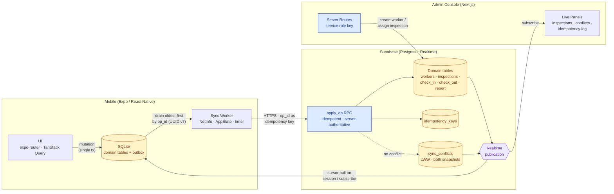

# Workforce Operations — Offline Sync Demo (Part 1)

Production-shaped offline sync engine for a workforce operations
platform: an Expo (React Native) field-worker app with a SQLite outbox,
idempotent server writes, exponential-backoff retries, dead-letter
handling, and server-authoritative conflict resolution; plus a Next.js
ops console that issues worker accounts, assigns inspections, and proves
sync correctness through live Realtime panels.

> Read [`ARCHITECTURE.md`](./ARCHITECTURE.md) for the full design
> writeup. This README is just how to run it.

## Architecture



**Flow at a glance.** Every mobile mutation lands in SQLite *and* the outbox in one transaction, so the UI updates instantly and survives force-quits. The sync worker drains the outbox oldest-first, calling `apply_op` with `op_id` as the idempotency key — retries are free, duplicates are dropped. The server is authoritative: on conflict it writes both snapshots to `sync_conflicts` (LWW, server wins). Realtime fans out every committed change to other devices and the admin console.

## Repo layout

```
workforce-operation/
├── ARCHITECTURE.md            # design doc — decisions + tradeoffs
├── README.md                  # you are here
├── backend/
│   ├── supabase/
│   │   ├── config.toml
│   │   ├── migrations/        # 0001 schema · 0002 RLS · 0003 RPCs
│   │   └── seed.sql           # admin + demo worker
│   └── types.ts               # shared TS types (mobile + admin import)
├── admin/                     # Next.js ops console
└── mobile/                    # Expo field-worker app
```

## Prereqs

- [Node](https://nodejs.org) 20+
- [Supabase CLI](https://supabase.com/docs/guides/cli)
- [Expo Go](https://expo.dev/go) on your phone (or an iOS / Android sim)

## 1. Boot the backend

```bash
cd backend
supabase start                # downloads images first time
supabase db reset             # runs migrations + seed.sql
```

`supabase start` prints four important values:

```
API URL:                http://127.0.0.1:54321
anon key:               eyJ...
service_role key:       eyJ...
```

Keep this terminal open.

## 2. Boot the admin

In a second terminal:

```bash
cd admin
cp .env.example .env.local
# paste API URL + anon key + service_role key into .env.local
npm install
npm run dev                   # http://localhost:3000
```

Sign in: **admin@example.com / admin1234**.

## 3. Boot the mobile app

In a third terminal:

```bash
cd mobile
cp .env.example .env
# paste API URL + anon key into .env
npm install
npx expo start                # then 'i' (iOS) or 'a' (Android)
```

> Expo Go on a real phone reaches your laptop's Supabase via your LAN
> IP. Replace `127.0.0.1` in `mobile/.env` with your laptop's IP
> (e.g. `http://192.168.1.42:54321`) so the phone can reach it.

Sign in: **worker@example.com / worker1234**.

## 4. Demo script (the part you'll record)

Run through this sequence on a real phone or simulator with the admin
console open in a browser side-by-side. Every checkpoint maps to a
client requirement — *queue persistence*, *retry handling*,
*reconciliation*, *offline sync*.

| # | Action | What proves what |
|---|---|---|
| 1 | In admin, **Create worker** → Alice (`alice@x.com / alice1234`) | Server route uses service-role; admin/mobile auth split is enforced |
| 2 | In admin, **Assign inspection** to Alice ("HVAC — 12 Main St") | Live panel shows row appear; Alice has not connected yet |
| 3 | Sign in to mobile as Alice — list shows the new inspection | Cursor pull on session start; SQLite caches the row |
| 4 | Turn on **airplane mode** on the phone | All subsequent actions go through the offline path |
| 5 | Tap inspection → **Check in** (grants GPS) → write notes → **Save report** | Three mutations queued in the outbox; UI updates instantly |
| 6 | Open **Sync Inspector** | Pending = 3, all in op_id order |
| 7 | Force-quit the app, relaunch | Outbox survives — proof of queue persistence |
| 8 | Disable airplane mode | Sync Inspector drains live; admin console rows light up via Realtime |
| 9 | In `psql` (or Supabase Studio), `UPDATE inspections SET title='renamed' WHERE id=…` while Alice has a queued mutation against the same row | apply_op writes to `sync_conflicts`; mobile shows a conflict (server wins, LWW); admin's "Conflict log" panel shows the entry |
| 10 | Temporarily edit `apply_op` to `RAISE EXCEPTION 'boom'` (XX000), have Alice make a mutation | Sync Inspector shows attempt counter + backoff countdown; revert the function and the op succeeds |
| 11 | Try to push a forged mutation against another worker's inspection (e.g. by editing payload via debugger) | apply_op returns `42501`; mobile marks dead; tap **Discard** or **Retry** in the Sync Inspector |

## What "correct" looks like

- **Idempotency**: in `idempotency_keys` table you'll see one row per
  unique `op_id`. Retrying a delivered op never duplicates the effect.
- **Ordering**: `outbox.op_id` (UUID v7) is time-ordered. The drain
  consumes oldest-first, so two mutations against the same row land in
  the order the worker took them.
- **Reconciliation**: any conflict appears once in `sync_conflicts`
  with both snapshots; no row in any domain table ever has a "lost"
  intermediate version.
- **Retry**: `outbox.attempts` counts failures; `next_attempt_at` is
  visibly farther in the future after each transient error; after 8
  attempts state moves to `dead`.

## Troubleshooting

- **Phone can't reach Supabase**: `127.0.0.1` only resolves on the
  laptop. Use the LAN IP (`ipconfig getifaddr en0` on macOS) in
  `mobile/.env`.
- **Schema changes**: `cd backend && supabase db reset` re-runs all
  migrations from scratch (drops local data).
- **"Not an admin"** on admin login: only seeded admins are in the
  `admins` table; sign in as `admin@example.com`.
- **Realtime panels empty**: check `supabase_realtime` publication in
  the migration — all four domain tables + sync tables must be added.

## What's intentionally out of scope (Part 2)

See [`ARCHITECTURE.md` §11](./ARCHITECTURE.md#11-what-part-2-would-add).

- Geofencing background triggers (auto check-in)
- Scheduling / shift management
- Manual merge UI for conflicts
- Background sync via `expo-task-manager` (without the app open)
- Multi-tenant RLS, ops-side write workflows
- Observability: per-op latency, queue depth, conflict rate metrics
